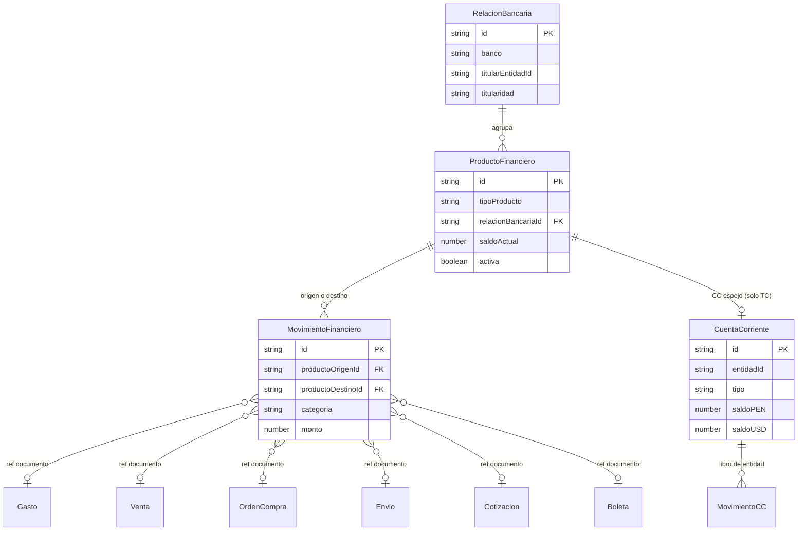

# ADR-PF-001 -- Refactor Producto Financiero Unificado

| Campo | Valor |
|-------|-------|
| **ID** | ADR-PF-001 |
| **Fecha** | 2026-04-28 |
| **Estado** | Aceptado |
| **Autores** | Jose Lopez (owner) + Claude (system-architect) |

**Resumen ejecutivo:** Se reemplaza `CuentaCaja` + `TarjetaCredito` por una sola entidad `ProductoFinanciero` con discriminator de tipo y vinculo explicito a `RelacionBancaria`. Se unifican 4 colecciones de movimientos en `movimientosFinancieros`. Se aprovecha que no hay datos criticos en produccion para hacer un reset completo (D-PF-7).

---

## 1. Contexto y motivacion

Jose observo que `CuentaCaja` y `TarjetaCredito` comparten campos clave (banco, titularidad, titularEntidadId) pero viven como hermanas planas en colecciones separadas. Una cuenta corriente BCP y una tarjeta BCP del mismo titular son "productos financieros del mismo banco del mismo titular" -- deberian estar agrupados.

Ademas, existen 4 tipos de movimiento repartidos en colecciones distintas (`movimientosTesoreria`, `cargosTarjeta`, `pagosEstadoCuentaTC`, `movimientosCC`) con logica duplicada de registro, idempotencia y afectacion de saldo.

El momento es ideal: la funcionalidad de tesoreria tiene uso real limitado (no hay datos criticos) y el usuario autorizo explicitamente un reset completo. Posponer aumentaria el costo de migracion exponencialmente.

---

## 2. Decisiones cerradas (D-PF-1 a D-PF-7)

### D-PF-1 -- Entidad madre `ProductoFinanciero`

Una sola coleccion `productosFinancieros` con discriminator `tipoProducto`. Reemplaza `cuentasCaja` + `tarjetasCredito`.

Tipos: `cuenta_corriente`, `cuenta_ahorros`, `tarjeta_credito`, `tarjeta_debito`, `caja_efectivo`, `wallet_digital` (PayPal, Wise, MercadoPago, Zelle, Binance — saldo propio independiente del banco).

**Racional:** Yape/Plin/SIP/Agora/BIM operativamente NO tienen saldo propio — comparten el saldo de la cuenta banco padre (Yape vive en BCP, Plin en IBK, SIP en Financiera Oh, etc.). Por eso se modelan como `canalesDigitales[]` adosados al ProductoFinanciero tipo banco, no como producto separado. La trazabilidad por canal preferido (BI: "qué medios usa el cliente") se resuelve con el campo `MovimientoFinanciero.canalUtilizado`. Resolución de P-1 (Opción C).

### D-PF-2 -- Vinculo titular - banco - productos (`RelacionBancaria`)

Entidad explicita con campos: titularEntidadId, titularEntidadTipo, banco, bancoNombreCompleto, oficialDeCuenta?, fechaApertura?, numeroCliente?. Cada `ProductoFinanciero` tiene `relacionBancariaId?`. Productos sin banco (efectivo, wallets digitales globales) NO tienen relacion bancaria.

**Racional:** Permite agrupar "BCP Ahorros + BCP Corriente + BCP Visa" bajo un solo nodo en la UI sin joins costosos.

### D-PF-3 -- Saldos: Hibrido (libro mayor + cache)

`MovimientoFinanciero` es la fuente de verdad. `ProductoFinanciero.saldoActual` es cache. Recalculo por: trigger al insertar movimiento, cron mensual, boton manual.

### D-PF-4 -- Movimientos unificados

Una sola coleccion `movimientosFinancieros` reemplaza `movimientosTesoreria` + `cargosTarjeta` + `pagosEstadoCuentaTC`. (NOTA: `movimientosCC` NO se toca -- sigue siendo el libro de cuenta corriente por entidad externa.)

### D-PF-5 -- Wizard unico universal

Extender el `CuentaWizard` actual (4 pasos) para soportar todos los tipos de producto, incluyendo tarjeta_credito con campos condicionales (linea, dia corte, dia pago, marca, ultimosDigitos).

### D-PF-6 -- Migracion de TODAS las referencias cruzadas

Toda referencia a `cuentaPagoId`, `cuentaCobroId`, `cuentaOrigen`, `cuentaDestino`, `tarjetaId`, `tarjetaCreditoId` en todo el sistema migra a `productoFinancieroId` / `productoFinancieroOrigenId` / `productoFinancieroDestinoId`.

### D-PF-7 -- Reset completo de datos

Borrar `productosFinancieros` (si existe) / `cuentasCaja` / `tarjetasCredito` / `cargosTarjeta` / `pagosEstadoCuentaTC` / `movimientosTesoreria` y limpiar referencias huerfanas. Recapturar manualmente.

---

## 3. Modelo de datos definitivo

### 3.1 ProductoFinanciero

```ts
// Resolucion P-1 (Opcion C): Yape/Plin/SIP/Agora/BIM NO son productos
// independientes -- son CANALES adosados a una cuenta banco. Solo wallets
// con saldo PROPIO independiente del banco son `wallet_digital` (PayPal,
// Wise, MercadoPago, Zelle, Binance).
export type TipoProductoFinanciero =
  | 'cuenta_corriente'
  | 'cuenta_ahorros'
  | 'tarjeta_credito'
  | 'tarjeta_debito'
  | 'caja_efectivo'
  | 'wallet_digital';   // PayPal, Wise, MercadoPago, Zelle, Binance (saldo propio)

export type ProveedorWallet =
  | 'paypal' | 'wise' | 'mercadopago' | 'zelle' | 'binance';

// Canales digitales locales (Yape, Plin, etc.) = adosados a cuenta banco.
// Cada tipo de canal pertenece a UN banco especifico (invariante operativo).
export type TipoCanalDigital = 'yape' | 'plin' | 'sip' | 'agora' | 'bim';

/**
 * Mapeo canal -> banco al que SOLO puede adosarse.
 * Validacion: un ProductoFinanciero con canal `yape` debe tener
 * `relacionBancaria.banco === 'BCP'`. Si no coincide, error en form.
 */
export const CANAL_BANCO_MAP: Record<TipoCanalDigital, string> = {
  yape:  'BCP',             // Banco de Credito del Peru
  plin:  'IBK',             // Interbank
  sip:   'Financiera Oh',   // Financiera Oh
  agora: 'AGORA',           // REQUIERE CONFIRMACION DEL USUARIO en F1
  bim:   'BIM',             // REQUIERE CONFIRMACION DEL USUARIO en F1
};

// Multiples canales pueden compartir mismo titular + numero de telefono
// (ej: el mismo numero 999111222 vinculado a Yape de BCP-A y Plin de IBK-A).
// La unicidad operativa NO es por numero, es por (banco, numero).

export type MarcaTarjeta = 'visa' | 'mastercard' | 'amex' | 'diners' | 'otro';
export type TitularidadPF = 'empresa' | 'personal';
export type TipoEntidadTitularPF = 'empleado' | 'colaborador' | 'proveedor' | 'cliente';
export type MonedaPF = 'USD' | 'PEN';

export interface ProductoFinanciero {
  id: string;
  codigo: string;                          // PF-001, PF-002
  nombre: string;                          // "BCP Cta Ahorros USD", "Visa BBVA ****6411"
  tipoProducto: TipoProductoFinanciero;

  // -- Vinculacion bancaria (null para caja_efectivo y wallets sin banco) --
  relacionBancariaId?: string;

  // -- Moneda --
  moneda: MonedaPF;                        // Moneda principal
  esBiMoneda: boolean;                     // true = USD + PEN simultaneos

  // -- Saldos (cache, fuente de verdad = movimientos) --
  saldoActual: number;                     // Mono-moneda
  saldoUSD?: number;                       // Solo bi-moneda
  saldoPEN?: number;                       // Solo bi-moneda
  saldoActualizadoEn: Timestamp;

  // -- Alertas --
  saldoMinimo?: number;
  saldoMinimoUSD?: number;
  saldoMinimoPEN?: number;

  // -- Titularidad --
  titularidad: TitularidadPF;
  titularEntidadId?: string;               // Solo si titularidad='personal'
  titularEntidadTipo?: TipoEntidadTitularPF;
  titularNombre?: string;

  // -- Datos bancarios (solo cuenta_corriente / cuenta_ahorros) --
  numeroCuenta?: string;
  cci?: string;
  // Numeros adicionales (SWIFT, IBAN, etc.)
  numerosAdicionales?: Array<{ tipo: string; numero: string; etiqueta?: string }>;

  // -- Tarjeta debito --
  cuentaVinculadaId?: string;              // Producto de ahorros vinculado

  // -- Tarjeta credito (condicional) --
  ultimosDigitos?: string;
  marca?: MarcaTarjeta;
  diaCorte?: number;
  diaPago?: number;
  topeControlUSD?: number;
  topeControlPEN?: number;
  cuentaPagoDefaultId?: string;

  // -- Wallet --
  proveedorWallet?: ProveedorWallet;
  identificadorWallet?: string;            // email, telefono, alias

  // -- Metodos de pago que acepta --
  metodosDisponibles?: string[];

  // -- Canales digitales adosados (Yape/Plin/SIP/Agora/BIM SOBRE cuenta banco) --
  // Solo aplica a productos tipo cuenta_corriente / cuenta_ahorros.
  // Cada canal debe coincidir con CANAL_BANCO_MAP[tipo] === relacionBancaria.banco.
  canalesDigitales?: Array<{
    tipo: TipoCanalDigital;
    identificador: string;     // Numero telefono / alias
    titular?: string;          // Display titular del canal (puede ser distinto al de la cuenta)
  }>;

  // -- Estado --
  activa: boolean;

  // -- Auditoria --
  creadoPor: string;
  fechaCreacion: Timestamp;
  actualizadoPor?: string;
  fechaActualizacion?: Timestamp;
}
```

### 3.2 RelacionBancaria

```ts
export interface RelacionBancaria {
  id: string;
  banco: string;                           // "BCP", "IBK", "BBVA"
  bancoNombreCompleto: string;
  titularEntidadId?: string;               // El titular en el banco
  titularEntidadTipo?: TipoEntidadTitularPF;
  titularNombre?: string;
  titularidad: TitularidadPF;
  oficialDeCuenta?: string;
  numeroCliente?: string;
  fechaApertura?: Timestamp;
  notas?: string;

  // Auditoria
  creadoPor: string;
  fechaCreacion: Timestamp;
}
```

### 3.3 MovimientoFinanciero

```ts
export type CategoriaMovimientoFinanciero =
  // Entradas
  | 'ingreso_venta'
  | 'ingreso_anticipo'
  | 'ingreso_otro'
  | 'aporte_capital'
  // Salidas
  | 'pago_orden_compra'
  | 'pago_viajero'
  | 'pago_proveedor_local'
  | 'gasto_operativo'
  | 'retiro_socio'
  | 'pago_nomina'
  | 'adelanto_empleado'
  | 'pago_estado_cuenta_tc'
  // Internos
  | 'transferencia_interna'
  | 'conversion_entrada'
  | 'conversion_salida'
  // Tarjeta credito
  | 'cargo_tc'
  // Ajustes
  | 'ajuste_positivo'
  | 'ajuste_negativo';

export type EstadoMovimientoFinanciero = 'pendiente' | 'ejecutado' | 'anulado';

export interface MovimientoFinanciero {
  id: string;
  numeroMovimiento: string;                // MF-2026-001

  categoria: CategoriaMovimientoFinanciero;
  estado: EstadoMovimientoFinanciero;

  // Productos afectados
  productoOrigenId?: string;               // Producto de donde SALE el dinero
  productoDestinoId?: string;              // Producto donde ENTRA el dinero
  // (transferencia: ambos; ingreso: solo destino; egreso: solo origen; cargo_tc: solo origen=TC)

  // Monto
  moneda: MonedaPF;
  monto: number;
  tipoCambio: number;
  montoEquivalentePEN: number;
  montoEquivalenteUSD: number;

  // Linea de negocio
  lineaNegocioId?: string;
  lineaNegocioNombre?: string;

  // Metodo y referencia
  metodo?: string;
  referencia?: string;

  // Canal especifico utilizado (resolucion P-1 / D-S58-CANAL).
  // Permite a BI reportar "que medios prefieren los clientes" sin tener
  // que crear productos fantasma para Yape/Plin/SIP/Agora/BIM.
  // Vacio cuando aplica solo `metodo` (transferencia bancaria, efectivo, etc.).
  canalUtilizado?:
    | 'yape' | 'plin' | 'sip' | 'agora' | 'bim'      // wallet local
    | 'transferencia_bancaria' | 'cheque' | 'efectivo'
    | 'tarjeta_fisica' | 'pos' | 'link_pago'
    | 'paypal' | 'wise' | 'mercadopago' | 'zelle' | 'binance';

  // Documentos relacionados (polimorficos)
  refDocumentoTipo?: 'oc' | 'venta' | 'gasto' | 'envio' | 'cotizacion' | 'boleta' | 'conversion' | 'cargo_tc' | 'pago_tc' | 'lote_masivo';
  refDocumentoId?: string;
  refDocumentoNumero?: string;

  // Lote padre (cuando el movimiento nace de un Pago Masivo · LotePago)
  // Permite filtrar el libro mayor por lote y reconstruir el batch.
  loteId?: string;                         // ID del LotePago padre
  loteNumero?: string;                     // LOTE-2026-001 (denormalizado)

  // Descripcion
  concepto: string;
  notas?: string;
  urlComprobante?: string;

  // Fechas
  fecha: Timestamp;
  fechaProgramada?: Timestamp;

  // Idempotencia
  idempotencyKey?: string;

  // Auditoria
  creadoPor: string;
  fechaCreacion: Timestamp;
  actualizadoPor?: string;
  fechaActualizacion?: Timestamp;
}
```

### 3.4 Relacion con CuentaCorriente (S55)

`CuentaCorriente` y `MovimientoCC` **NO se eliminan**. Siguen siendo el saldo agregado por entidad externa (cliente, proveedor, colaborador, empleado, tarjeta_credito). La CC de tipo `tarjeta_credito` sigue funcionando identica -- solo cambia que su `entidadId` ahora apunta a un `ProductoFinanciero.id` en lugar de un `TarjetaCredito.id`.

Flujo: Un cargo a TC genera (1) un `MovimientoFinanciero` categoria `cargo_tc` y (2) un `MovimientoCC` tipo `debito_cargo_tc` en la CC espejo.

---

## 4. Schema de Firestore

### Colecciones nuevas

| Coleccion | Path | Descripcion |
|-----------|------|-------------|
| `productosFinancieros` | `/productosFinancieros/{id}` | Entidad madre |
| `relacionesBancarias` | `/relacionesBancarias/{id}` | Vinculacion banco-titular |
| `movimientosFinancieros` | `/movimientosFinancieros/{id}` | Libro mayor unificado |

### Colecciones que se eliminan (post-reset)

`cuentasCaja`, `tarjetasCredito`, `cargosTarjeta`, `pagosEstadoCuentaTC`, `movimientosTesoreria`.

### Indices recomendados

```
productosFinancieros: [tipoProducto, activa] | [relacionBancariaId] | [titularEntidadId, titularEntidadTipo]
movimientosFinancieros: [productoOrigenId, fecha desc] | [productoDestinoId, fecha desc] | [categoria, fecha desc] | [refDocumentoId]
relacionesBancarias: [titularEntidadId, titularEntidadTipo]
```

### Security rules

Las reglas deben replicar el patron actual de `cuentasCaja`: lectura/escritura solo para usuarios autenticados. No se requiere separacion por rol (Jose es el unico usuario activo).

---

## 5. Estrategia de coexistencia

Durante las fases F0-F4, los tipos viejos y nuevos coexisten en el codigo.

### Type aliases deprecated

```ts
// src/types/tesoreria.types.ts — agregar al final
/** @deprecated Usar ProductoFinanciero. Se elimina en Fase 5. */
export type CuentaCajaLegacy = CuentaCaja;
/** @deprecated Usar MovimientoFinanciero. Se elimina en Fase 5. */
export type MovimientoTesoreriaLegacy = MovimientoTesoreria;
```

### Adaptadores temporales (F1-F4)

```ts
// src/services/productoFinanciero.adaptadores.ts
export function cuentaCajaToProductoFinanciero(c: CuentaCaja): ProductoFinanciero { ... }
export function productoFinancieroToCuentaCaja(pf: ProductoFinanciero): CuentaCaja { ... }
```

Estos adaptadores se usan en componentes que aun no se migraron para que lean de la nueva coleccion sin reescritura completa.

### Timeline de eliminacion

| Fase | Accion |
|------|--------|
| F2 | Marcar imports de CuentaCaja con `// MIGRATE-TO-PF` |
| F4 | Todos los consumers usan ProductoFinanciero directamente |
| F5 | Eliminar types/tesoreria.types.ts (CuentaCaja), types/tarjetaCredito.types.ts, adaptadores |

---

## 6. Plan de fases (F0-F5)

| Fase | Objetivo | Archivos crear/modificar | Criterio de salida | Sesion est. |
|------|----------|--------------------------|-------------------|-------------|
| **F0** | Tipos + colecciones + service base | Crear: `types/productoFinanciero.types.ts`, `types/movimientoFinanciero.types.ts`, `types/relacionBancaria.types.ts`, `services/productoFinanciero.service.ts`, `services/movimientoFinanciero.service.ts`, `services/relacionBancaria.service.ts`, `store/productoFinancieroStore.ts`. Modificar: `config/collections.ts`, `functions/src/collections.ts` | tsc 0 errores, CRUD funcional en consola | 1 sesion |
| **F1** | Wizard universal + UI listado | Crear: `pages/Tesoreria/ProductoWizard/*` (5 pasos). Modificar: `TabCuentas.tsx` (leer de nueva coleccion via adaptador) | Crear/editar PF de todos los tipos desde UI | 1-2 sesiones |
| **F2** | Movimientos unificados + saldo cache | Crear: servicio de registro unificado con trigger de saldo. Modificar: `TabMovimientos.tsx`, `TabTransferencias.tsx`, `TabConversiones.tsx`, todos los services que registran movimientos (16 archivos) | Movimientos se escriben en nueva coleccion, saldo se actualiza | 2 sesiones |
| **F3** | Referencias cruzadas (frontend) | Modificar: `venta.pagos.service.ts`, `ordenCompra.pagos.service.ts`, `envio.pagos.service.ts`, `cotizacion.adelanto.service.ts`, `gasto.service.ts`, `planilla.service.ts`, `pagoMasivo.service.ts`, `reclamo.service.ts`, `devolucion.service.ts`, `pagoAbonoDistribuido.service.ts`, `contabilidad.service.ts`. Componentes con selectors de cuenta (GastoForm, VentaForm, etc.) | Todas las escrituras usan `productoFinancieroId` | 2 sesiones |
| **F4** | Cloud Functions + integraciones | Modificar: `functions/src/mercadolibre/ml.orderProcessor.ts`, `ml.diagnostics.ts`, `ml.reconciliation.ts`, `ml.reingenieria.ts`, `ml.sync.ts`, `whatsapp/whatsapp.erp.ts`, `functions/src/collections.ts` | Functions leen/escriben nueva coleccion, deploy exitoso | 1 sesion |
| **F5** | Cleanup + reset datos + eliminacion legacy | Eliminar: `types/tesoreria.types.ts` (seccion CuentaCaja), `types/tarjetaCredito.types.ts`, `services/tarjetaCredito.service.ts`, `services/cargoTarjeta.service.ts`, `services/pagoEstadoCuentaTarjeta.service.ts`, carpeta `TarjetasCreditoV2/`, `TabTarjetasCredito.tsx`, forms legacy (EfectivoForm, DigitalForm, BancoNuevoForm, CuentaBancoForm). Ejecutar reset de datos. | 0 referencias a CuentaCaja/TarjetaCredito. tsc clean. Deploy. | 1 sesion |

**Total estimado: 8 sesiones.**

---

## 7. Mapeo de campos

### CuentaCaja -> ProductoFinanciero

| Campo CuentaCaja | Campo ProductoFinanciero | Nota |
|-----------------|-------------------------|------|
| id | id | nuevo UUID |
| nombre | nombre | |
| titular | titularNombre | |
| tipo ('efectivo'/'banco'/'digital'/'credito') | tipoProducto (inferido) | banco->cuenta_ahorros/corriente, digital->wallet_digital, efectivo->caja_efectivo, credito->tarjeta_debito |
| esBiMoneda | esBiMoneda | |
| moneda | moneda | |
| saldoActual | saldoActual | |
| saldoUSD / saldoPEN | saldoUSD / saldoPEN | |
| banco | -- | Migra a RelacionBancaria.banco |
| bancoNombreCompleto | -- | Migra a RelacionBancaria |
| numeroCuenta | numeroCuenta | |
| cci | cci | |
| productoFinanciero | tipoProducto | se mapea 1:1 |
| titularidad | titularidad | |
| titularEntidadId/Tipo/Nombre | titularEntidadId/Tipo/Nombre | |
| cuentaVinculadaId | cuentaVinculadaId | |
| metodosDisponibles | metodosDisponibles | |
| canalesDigitales | canalesDigitales | |
| lineaCredito.* | -- | Eliminado (era legacy TC en CuentaCaja) |
| metodosDetalle | -- | Eliminado (@deprecated) |
| metodoPagoAsociado | -- | Eliminado (legacy) |
| esCuentaPorDefecto | -- | Eliminado |
| numerosCuenta | numerosAdicionales | reshape |

### TarjetaCredito -> ProductoFinanciero (tipoProducto='tarjeta_credito')

| Campo TarjetaCredito | Campo ProductoFinanciero | Nota |
|---------------------|-------------------------|------|
| id | id | nuevo UUID |
| codigo | codigo | |
| nombre | nombre | |
| banco/bancoNombreCompleto | -- | Migra a RelacionBancaria |
| ultimosDigitos | ultimosDigitos | |
| marca | marca | |
| moneda / esBiMoneda | moneda / esBiMoneda | |
| titularidad/EntidadId/Tipo/Nombre | titularidad/EntidadId/Tipo/Nombre | |
| topeControlUSD/PEN | topeControlUSD/PEN | |
| diaCorte / diaPago | diaCorte / diaPago | |
| cuentaPagoDefaultId | cuentaPagoDefaultId | |
| limiteUSD | -- | Eliminado (@deprecated) |
| saldoActualUSD | -- | Eliminado (se deriva de CC) |
| disponibleUSD | -- | Eliminado |

---

## 8. Mapeo de referencias cruzadas

| Archivo/Tipo | Campo actual | Campo nuevo | Cloud Function? |
|-------------|-------------|-------------|-----------------|
| `pago.types.ts` PagoUnificado | cuentaOrigenId/Nombre | productoOrigenId/Nombre | No |
| `ordenCompra.types.ts` PagoOC | cuentaOrigenId/Nombre | productoOrigenId/Nombre | No |
| `gasto.types.ts` Gasto.pagos[] | cuentaOrigenId/Nombre | productoOrigenId/Nombre | No |
| `venta.types.ts` CobroVenta | cuentaDestinoId | productoDestinoId | No |
| `cotizacion.types.ts` AdelantoCotizacion | cuentaDestinoId | productoDestinoId | No |
| `entrega.types.ts` CobroEntrega | cuentaDestinoId | productoDestinoId | No |
| `envio.types.ts` PagoColaborador | cuentaOrigenId/Nombre | productoOrigenId/Nombre | No |
| `reclamo.types.ts` ReembolsoReclamo | cuentaCobroId | productoDestinoId | No |
| `devolucion.types.ts` | cuentaOrigenId | productoOrigenId | No |
| `tarjetaCredito.types.ts` CargoTarjeta | tarjetaCreditoId | productoFinancieroId | No |
| `tarjetaCredito.types.ts` PagoEstadoCuentaTarjeta | tarjetaCreditoId + cuentaOrigenId | productoTCId + productoOrigenId | No |
| `tesoreria.types.ts` MovimientoTesoreria | cuentaOrigen/cuentaDestino | -- | Eliminado (reemplazado por MovimientoFinanciero) |
| `tesoreria.types.ts` Transferencia/Conversion | cuentaOrigenId/cuentaDestinoId | productoOrigenId/productoDestinoId | No |
| `pagoMasivo.types.ts` LotePago (entidad agregadora) | cuentaId / cuentaNombre | productoFinancieroId / productoFinancieroNombre | No |
| `pagoMasivo.types.ts` ConfigPagoMasivo (UI) | cuentaId / cuentaNombre | productoFinancieroId / productoFinancieroNombre | No |
| `pagoMasivo.service.ts` ejecutarLote() | crea N MovimientoTesoreria | crea N MovimientoFinanciero con `loteId` populado | No |
| `ml.orderProcessor.ts` | cuentaMPId (hardcoded lookup a cuentasCaja) | productoMPId (lookup a productosFinancieros) | **Si** |
| `ml.reconciliation.ts` | cuentaOrigen/cuentaDestino en queries | productoOrigenId/productoDestinoId | **Si** |
| `ml.diagnostics.ts` | cuentaOrigenId | productoOrigenId | **Si** |
| `ml.reingenieria.ts` | cuentaOrigen/cuentaDestino | productoOrigenId/productoDestinoId | **Si** |
| `ml.sync.ts` | cuentaOrigenId + cuentaOrigen | productoOrigenId | **Si** |
| `whatsapp.erp.ts` | CUENTAS_CAJA lookup | PRODUCTOS_FINANCIEROS lookup | **Si** |

---

## 9. Reset de datos (D-PF-7)

Procedimiento manual (ejecutar desde consola Firebase o script de admin):

```
1. BACKUP: Exportar colecciones a JSON (firebase-admin script)
   - cuentasCaja
   - tarjetasCredito
   - cargosTarjeta
   - pagosEstadoCuentaTC
   - movimientosTesoreria
   - conversionesCambiarias
   - lotePagos                           // Pagos Masivos · TAREA-101

2. LIMPIAR REFERENCIAS en documentos vivos:
   - gastos: borrar campos cuentaOrigenId, cuentaOrigenNombre de cada pago[]
   - ventas: borrar cuentaDestinoId de cada cobro[]
   - ordenesCompra: borrar cuentaOrigenId/Nombre de historialPagos[]
   - envios: borrar cuentaOrigenId/Nombre de pagosColaborador[]
   - cotizaciones: borrar cuentaDestinoId de adelantos[]
   - reclamos: borrar cuentaCobroId

3. ELIMINAR colecciones completas:
   - deleteCollection('cuentasCaja')
   - deleteCollection('tarjetasCredito')
   - deleteCollection('cargosTarjeta')
   - deleteCollection('pagosEstadoCuentaTC')
   - deleteCollection('movimientosTesoreria')
   - deleteCollection('conversionesCambiarias')
   - deleteCollection('lotePagos')         // Pagos Masivos · TAREA-101

4. LIMPIAR CC espejo de tarjetas:
   - Borrar docs en cuentasCorrientes donde tipo='tarjeta_credito'
   - Borrar movimientosCC con cuentaCorrienteId que empiece con 'tarjeta_credito_'

5. RESETEAR contadores:
   - contadores/movimientosTesoreria -> 0
   - contadores/conversionesCambiarias -> 0
   - contadores/cargosTarjeta -> 0
   - contadores/lotePagos -> 0           // Pagos Masivos
   - contadores/movimientosFinancieros -> 0  // Nueva coleccion unificada

6. VERIFICAR: Abrir /tesoreria y /finanzas -- debe estar vacio sin errores.

7. RECAPTURAR: Crear productos financieros manualmente con el nuevo wizard.
```

---

## 10. Riesgos y mitigaciones

| # | Riesgo | Prob. | Impacto | Mitigacion |
|---|--------|-------|---------|------------|
| 1 | Cloud Functions desplegadas con tipos viejos cuando frontend ya migro | Alta | Critico | F4 (CF) se ejecuta ANTES de F5 (cleanup). Deploy CF y frontend en la misma sesion. Usar flag `PF_V2_ACTIVE` en Firestore config para switch atomico. |
| 2 | WhatsApp bot / ML reconciliation creando registros con shape viejo | Alta | Alto | Actualizar CF en F4 antes del reset. Despues del reset, los lookups a `cuentasCaja` fallaran silenciosamente -- agregar guard con log a `_errorLog`. |
| 3 | Reportes contables que asumen estructura de tesoreria especifica | Media | Alto | `contabilidad.service.ts` se actualiza en F3. El adaptador temporal garantiza backward-compat durante la transicion. |
| 4 | `relacionBancariaId` huerfano si se edita/elimina la relacion | Baja | Medio | Soft-delete en RelacionBancaria (campo `activa`). El servicio de eliminacion verifica si hay PF vinculados y bloquea. |
| 5 | Saldos cacheados desincronizados del libro mayor | Media | Alto | Triple mecanismo (D-PF-3): trigger inmediato + cron mensual + boton manual. El cron detecta divergencias y emite alerta. |
| 6 | Wizard unico mas complejo que los 7 wizards actuales | Media | Medio | Usar registry pattern (como EnvioWizard S53). Cada `tipoProducto` registra sus campos condicionales. El stepper muestra solo los pasos relevantes. |
| 7 | Tests existentes que esperan shape viejo | Baja | Bajo | No hay tests automatizados en el proyecto (deuda tecnica conocida). No aplica. |
| 8 | Tipo `MonedaTesoreria` reusado en 20+ archivos | Media | Medio | Crear `MonedaPF` como alias de `'USD' | 'PEN'`. Mantener `MonedaTesoreria` como alias deprecated hasta F5 para evitar renames masivos innecesarios en F0. |
| 9 | Periodo de indisponibilidad durante el reset | Baja | Medio | El reset se ejecuta en una sola sesion (F5) con el sistema en baja actividad. Jose recaptura los ~10-15 productos en 30 min. |
| 10 | Pagos historicos en gastos/ventas/OCs pierden trazabilidad a la cuenta | Media | Medio | Los campos `cuentaOrigenId` existentes en docs historicos se dejan como estan (IDs huerfanos) -- no rompen nada, solo no resuelven en UI. Agregar fallback "Cuenta eliminada" en display. |

---

## 11. Criterios de aceptacion de go-live

1. `tsc -b` compila con 0 errores y 0 referencias a `CuentaCaja` o `TarjetaCredito` (excepto type aliases deprecated si F5 esta pendiente).
2. Crear un ProductoFinanciero de cada tipo (7) desde el wizard y verificar que aparece en listado.
3. Registrar un movimiento (ingreso) y verificar que `saldoActual` se actualiza automaticamente.
4. Hacer una transferencia interna entre dos productos y verificar saldos de ambos.
5. Registrar un cargo a tarjeta de credito y verificar que la CC espejo se debita.
6. Pagar estado de cuenta de TC y verificar que CC se acredita + movimiento de tesoreria se crea.
7. Crear una venta, cobrar, y verificar que `productoDestinoId` se graba correctamente.
8. Crear una OC, pagar, y verificar que `productoOrigenId` se graba correctamente.
9. Sincronizar una orden ML y verificar que la Cloud Function escribe `productoDestinoId` (no `cuentaDestino`).
10. Vista `/finanzas/saldos` muestra saldos de todos los productos agrupados por RelacionBancaria.
11. El boton "recalcular saldos" en TabCuentas produce saldos identicos a la suma de movimientos.
12. `vite build` < 25s sin warnings de imports muertos.

---

## 12. Apendice A -- Diagrama de relaciones



---

## 13. Apendice B -- Tabla resumen de wizards

| # | Wizard actual | Ubicacion | Destino en refactor |
|---|--------------|-----------|-------------------|
| 1 | CuentaWizard (4 pasos: Tipo, Identidad, Saldo, Metodos) | `pages/Tesoreria/CuentaWizard/` | **Se extiende** como ProductoWizard universal. Paso 1 agrega tipos TC/wallet. Paso 2.5 condicional para TC. |
| 2 | BancoNuevoForm | `pages/Tesoreria/BancoNuevoForm.tsx` | **Absorbido** por Paso 2 del ProductoWizard (seccion "crear relacion bancaria inline"). |
| 3 | CuentaBancoForm | `pages/Tesoreria/CuentaBancoForm.tsx` | **Absorbido** por Paso 2 (datos bancarios). |
| 4 | DigitalForm | `pages/Tesoreria/DigitalForm.tsx` | **Absorbido** por Paso 2 (variante wallet con selector de proveedor). |
| 5 | EfectivoForm | `pages/Tesoreria/EfectivoForm.tsx` | **Absorbido** por Paso 2 (variante minima: solo nombre + moneda). |
| 6 | CargarTarjetaWizard (3 pasos) | `pages/Tesoreria/TarjetasCreditoV2/CargarTarjetaWizard/` | **Se mantiene** como wizard de operacion (no de creacion). Migra a usar `productoFinancieroId` en lugar de `tarjetaCreditoId`. |
| 7 | PagarEstadoCuentaWizard (3 pasos) | `pages/Tesoreria/TarjetasCreditoV2/PagarEstadoCuentaWizard/` | **Se mantiene** como wizard de operacion. Migra campos. |

**Nota:** Los wizards 6 y 7 son wizards de OPERACION (cargar deuda, pagar deuda), no de CREACION de producto. Se mantienen como flujos separados pero sus inputs/outputs migran al nuevo modelo.

---

## 14. Preguntas abiertas -- TODAS RESUELTAS

**P-1 · wallet_local como producto independiente vs canal** -- RESUELTA: Opcion C
> Yape/Plin/SIP/Agora/BIM NO son productos independientes -- son CANALES adosados a
> una cuenta banco. Cada tipo de canal pertenece a UN banco especifico (CANAL_BANCO_MAP).
> El saldo es uno solo, el de la cuenta padre.
> Se agrega `MovimientoFinanciero.canalUtilizado` para que BI pueda reportar "que
> medios prefieren los clientes" sin inventar productos fantasma.
> Multiples canales pueden compartir mismo titular + numero de telefono (un mismo
> numero 999111222 puede ser Yape de BCP-A y Plin de IBK-A simultaneamente).

**P-2 · Scope de `ConversionCambiaria`** -- RESUELTA: Absorber
> Se absorbe como un par de `MovimientoFinanciero` con categorias
> `conversion_salida` (USD) + `conversion_entrada` (PEN) vinculados por
> `idempotencyKey` comun. No se mantiene coleccion separada.

**P-3 · `DatoBancarioPasivo` en fichas de terceros** -- RESUELTA: Fuera de scope
> Confirmado: solo es "contacto bancario" sin saldo en nuestro sistema.
> No entra en este refactor.

**Sin preguntas abiertas. ADR pasa a estado: ACEPTADO.**
